<div align="center">
  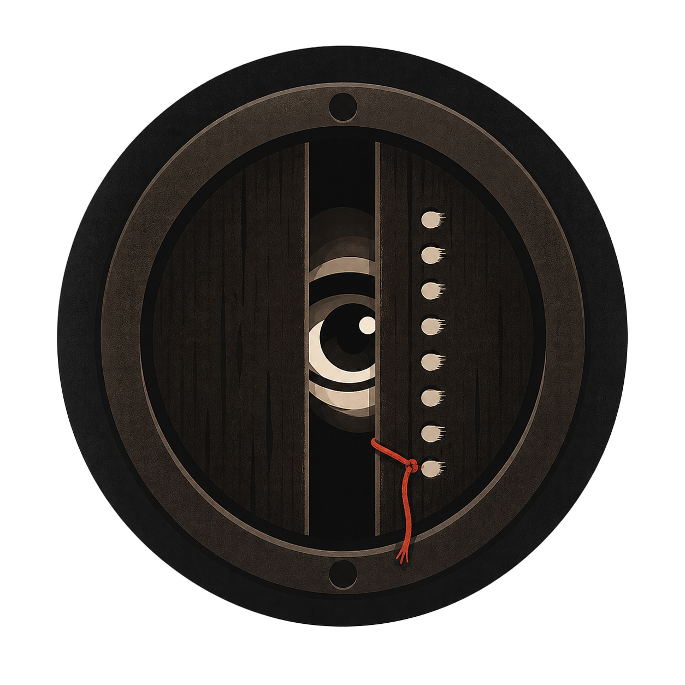
  <h1>xuanyituwen</h1>
  <p><strong>把一个异常，编排成一组连续的伪记录。</strong></p>
  <p>面向创作者的 Codex skill，用故事控制、空间锚点和逐图验收，生成六张以上的无字悬疑图组。</p>
  <p>
    
    
    
    
  </p>
  <p>
    <a href="#案例">案例</a> ·
    <a href="#工作流">工作流</a> ·
    <a href="#快速开始">快速开始</a> ·
    <a href="#设计原则">设计原则</a> ·
    <a href="#参与贡献">参与贡献</a>
  </p>
</div>

> `xuanyituwen` 的图片交付保持纯净无字。抖音发布页的配文、标题、话题和置顶评论，由创作者自行填写。

<p align="center">
  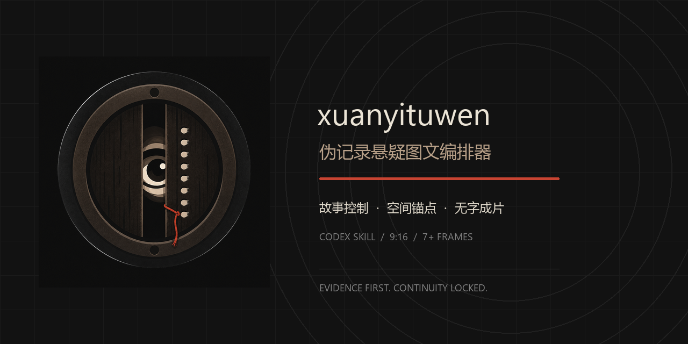
</p>

## 它是什么

普通的生图 prompt 往往会得到“每张都好看，但不是同一个故事”的结果：人物变脸、门链换边、道具换父面、时间线断裂，最后一张突然凭空增加一个新设定。

`xuanyituwen` 把这件事拆成一条可确认、可回溯的生产链：

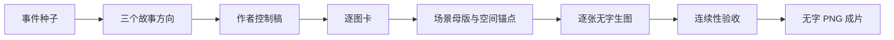

它不是观众版文案生成器，而是创作者的制作控制台：先把故事想清楚，再把每一张图变成可以检查的视觉证据。

## 案例

### 《猫眼里面的人》

一个新租客连续几晚在凌晨 3 点 16 分听见敲门声。猫眼外没有人，雾气却出现在门内侧；当他拆开猫眼，才发现门体后面藏着一段能容纳人的检修腔。

这套案例包含七张无字成片，节奏从普通室内记录，逐步推进到门体证据、检修腔和最后一张近距离跳脸。

<p align="center">
  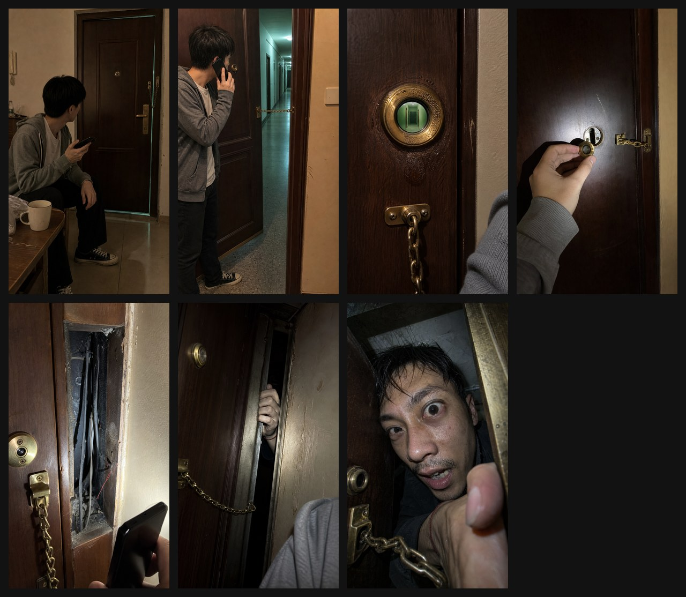
</p>

<table align="center">
  <tr>
    <td>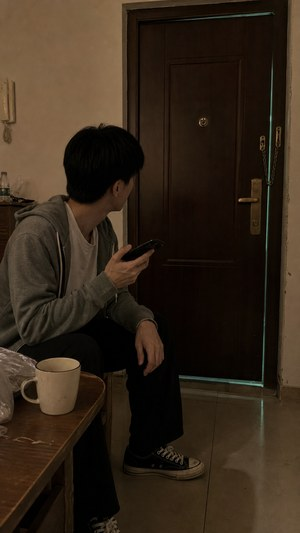</td>
    <td>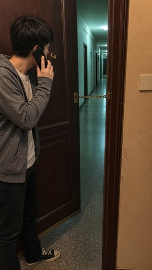</td>
    <td>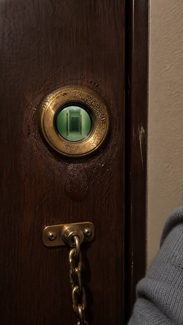</td>
    <td>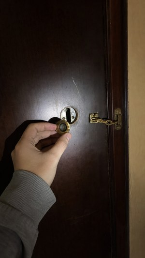</td>
  </tr>
  <tr>
    <td>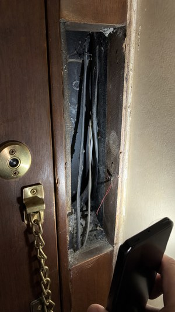</td>
    <td>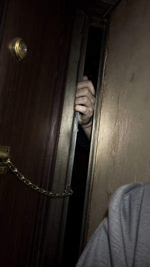</td>
    <td>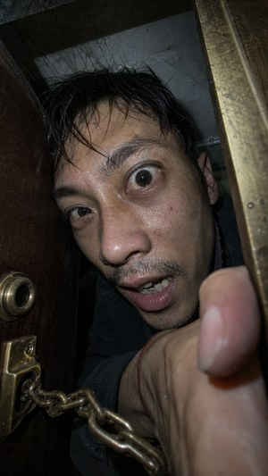</td>
    <td><strong>最终落点</strong><br>人一直在门里面。</td>
  </tr>
</table>

<p align="center"><em>示例图只负责提供画面证据，发布时的文字由创作者在抖音页面填写。</em></p>

## 核心能力

<table>
  <tr>
    <td width="25%"><strong>故事控制</strong><br>作者真相、信息权限、行动代价、伏笔回收和终局后果。</td>
    <td width="25%"><strong>连续图组</strong><br>默认七张，最低六张；每张都必须带来新事实、判断变化或新问题。</td>
    <td width="25%"><strong>空间锚点</strong><br>场景母版、父面、归一化坐标、相邻关系、朝向和禁止漂移项。</td>
    <td width="25%"><strong>纯净交付</strong><br>9∶16、1080×1920、RGB、无平台界面、无水印、无图片内文字。</td>
  </tr>
</table>

## 设计原则

### 证据先于解释

每张图都要能回答：画面给了什么证据，谁因此改变了判断，这个改变造成了什么后果。图片不依赖长段落解释故事。

### 空间锚点先于“保持一致”

关键物件不能只写“在右边”或“靠下”。每个锚点都必须登记：

- 它属于门扇、门框、墙面、地面、柜体还是设备。
- 它在场景母版中的归一化位置。
- 它与至少两个相邻锚点的关系。
- 它的朝向、尺度、上下顺序和允许变化。
- 哪些变化直接判定失败，例如镜像、换父面、重复出现或局部漂移。

所以铰链会被写成“属于门框，不属于门扇；位于固定门框条；三枚保持同一纵向排列”，而不是一句模糊的“门保持一致”。

### 恐怖逐步渗入

默认节奏是：

`日常记录 → 微小异常 → 可验证证据 → 验证失败 → 解释反转 → 终局跳脸`

最后一张不能凭空增加新身份、新能力或新世界规则。真正有力的跳脸，要让至少两处前文细节在最后重新变得可怕。

## 快速开始

### 安装到个人 Codex skills 目录

把仓库根目录复制到 Codex 的 skills 目录：

```powershell
Copy-Item -Recurse -Force . "$env:USERPROFILE\.codex\skills\xuanyituwen"
```

也可以把它放进某个项目的 `.agents/skills/` 目录，让它只对该项目生效。

### 在 Codex 中调用

```text
使用 $xuanyituwen 做一套伪记录悬疑图文。
事件种子：一个男生每天晚上收到已经搬走的室友发来的语音，语音里有逐渐靠近的脚步声。
先给我三个故事方向，不要生图。
```

skill 会在三个节点停下来等待创作者确认：

1. 三个故事方向之后。
2. 故事控制稿之后。
3. 逐图卡和空间锚点合同之后。

确认后，才逐张调用 `image_gen`，再把无字底图归一化为最终 PNG。

## 输出结构

```text
<story-slug>/
├── story-control.md
├── frame-plan.md
├── continuity-ledger.md
├── spatial-anchor-ledger.md
├── prompts/
├── base/
├── final/
└── README.md
```

其中：

- `base/` 是生图模型输出的原始无字底图。
- `final/` 是经过尺寸、色彩模式和 PNG 格式归一化的无字成片。
- `spatial-anchor-ledger.md` 是场景空间真相源。
- `prompts/` 保存每张实际发送给 `image_gen` 的完整 prompt，便于追查漂移来自哪一段。

## 仓库结构

| 路径 | 用途 |
| --- | --- |
| [`SKILL.md`](SKILL.md) | Codex 实际执行的主流程与硬性规则 |
| [`references/story-control-sheet.md`](references/story-control-sheet.md) | 作者控制稿模板 |
| [`references/frame-card.md`](references/frame-card.md) | 单张图的叙事、视觉和无字底图接口 |
| [`references/image-prompt-presets.md`](references/image-prompt-presets.md) | 生图 prompt 的模块化组装规则 |
| [`references/spatial-anchor-ledger.md`](references/spatial-anchor-ledger.md) | 场景母版与空间锚点合同 |
| [`references/quality-gate.md`](references/quality-gate.md) | 故事、连续性和成片验收门 |
| [`scripts/normalize_raster.py`](scripts/normalize_raster.py) | 无字底图的尺寸与 PNG 归一化 |
| [`evals/evals.json`](evals/evals.json) | 前向评测任务与评价维度 |
| [`assets/branding/logo.png`](assets/branding/logo.png) | 项目正式 logo |
| [`assets/branding/social-preview.png`](assets/branding/social-preview.png) | GitHub 仓库社交预览图 |
| [`assets/showcase/`](assets/showcase/) | 脱敏后的公开案例预览 |

## 质量门

交付前至少检查：

- 作者真相或不可解释规则明确。
- 至少三条线索在前文出现，结尾重新解释至少两处细节。
- 人物、场景、关键物件、时间和记录来源连续。
- 每个空间锚点的父面、局部位置、相邻关系、朝向和尺度稳定。
- 没有抖音界面、头像、用户名、点赞、评论、标题、分享按钮、水印或生图模型残留文字。
- `final/` 图片为 9∶16、1080×1920、RGB、纯净无字 PNG。

## 当前状态

核心生产链已经可以试跑真实故事：

`故事控制 → 空间锚定 → 逐图编排 → 无字生图 → 连续性验收 → 无字成片`

仍待补齐的开源工作：

- 选择并添加正式许可证。
- 增加更多不含个人信息的公开案例。
- 增加图像连续性的自动化回归检查。
- 在 GitHub Actions 中接入结构、脚本和样例检查。

## 参与贡献

最有价值的问题报告不是“图片好不好看”，而是指出：

- 哪一张图让故事因果断了。
- 哪个伏笔在回看时没有得到公平回收。
- 哪个物件换了父面、镜像了，或在画面中发生了不应有的漂移。
- 哪一张图的构图让决定性证据看不清。

提交案例时，请先移除个人信息、未获授权的图片、聊天记录和 API 密钥。

## 许可证

本仓库只包含 `xuanyituwen` skill，采用 MIT License。许可证文件位于 [`LICENSE`](LICENSE)。
