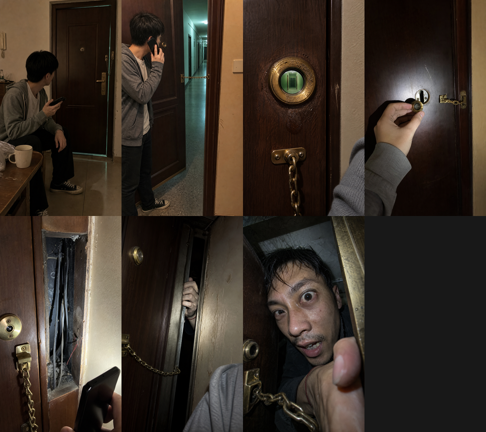

# 《猫眼里面的人》

- **图数**：七张。
- **视觉预设**：真实手机伪记录，旧出租屋与门体检修腔。
- **图片内文字**：废弃，所有 `base/` 和当前 `final/` 都保持纯净无字；第一人称发布配文独立保存在 `captions.md`。
- **生图规则**：底图不生成文字、不带抖音界面、不带账号信息、不带水印，并使用空间锚点合同锁定门体结构。
- **终局目标**：第七张使用近距离手机闪光跳脸，林峥的脸、眼睛和带红线的手直接侵入镜头。

## 目录

- `story-control.md`：作者真相、信息边界、伏笔和终局约束。
- `frame-plan.md`：七张逐图叙事与无字画面计划。
- `continuity-ledger.md`：人物、门体、猫眼、门链和检修腔状态迁移。
- `spatial-anchor-ledger.md`：场景母版、门体父面、局部坐标和固定邻接关系。
- `prompts/`：逐张实际发送给 `image_gen` 的无字底图 prompt。
- `captions.md`：七张第一人称发布配文、标题、引子、置顶评论和话题。
- `manifest.json`：FRAME、图片、prompt、配文和关键 ID 的绑定索引。
- `base/`：无字底图。
- `final/`：尺寸归一化后的无字最终图。
- `review.md`：本次人工验收记录。

本例的旧带文字试跑没有纳入公开示例，避免把“图片内无字”和“独立配文”混为一谈。
